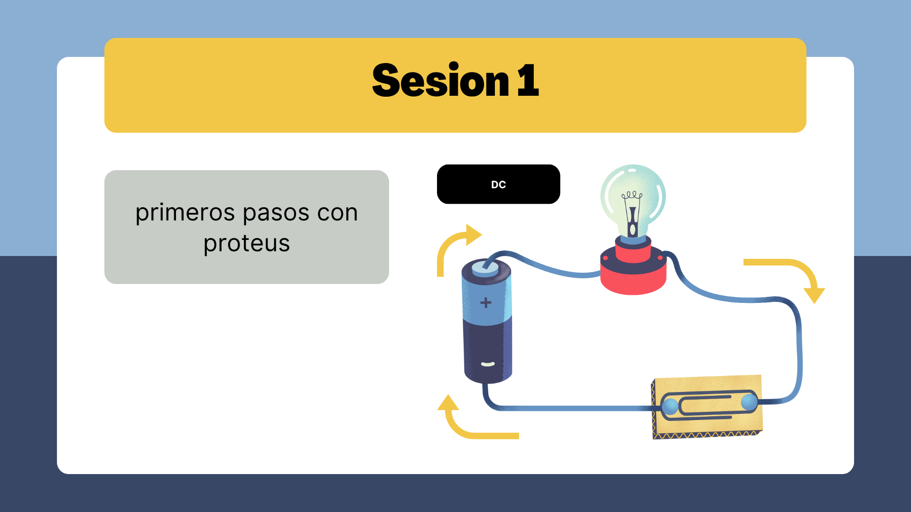

# Cómo Agregar Elementos en Proteus

¡Bienvenido! esta sesion 1 te explica paso a paso cómo agregar elementos (como resistencias, capacitores, transistores, etc.) a un proyecto en Proteus Design Suite. Proteus es un software de simulación de circuitos electrónicos que se usa mucho en ingeniería. Si eres estudiante de primer semestre, no te preocupes: seguiremos pasos simples y claros.

## Requisitos Previos
- Tener Proteus instalado en tu computadora.
- Un proyecto abierto en Proteus (por ejemplo, un archivo `.pdsprj`).

## Pasos para Agregar Elementos

### 1. Abre tu Proyecto en Proteus
- Inicia Proteus.
- Ve a **File > Open** y selecciona tu archivo de proyecto (como `proyecto1.pdsprj`).
- Si no tienes un proyecto, crea uno nuevo con **File > New Project**.

### 2. Accede a la Biblioteca de Componentes
- En la interfaz principal, mira la barra lateral izquierda. Ahí está la **Library Browser** (Biblioteca de Componentes).
- Si no la ves, ve a **View > Library Browser** para activarla.

### 3. Busca el Elemento que Necesitas
- En la **Library Browser**, escribe el nombre del componente en la barra de búsqueda. Por ejemplo:
  - "RES" para resistencias.
  - "CAP" para capacitores.
  - "TRANS" para transistores.
- Selecciona la categoría correcta si es necesario (como "Passive" para componentes pasivos o "Active" para activos).

### 4. Agrega el Elemento al Diseño
- Haz clic en el componente de la lista y arrástralo al área de diseño (el espacio blanco donde dibujas el circuito).
- Colócalo donde quieras en el esquema.

### 5. Configura el Elemento (Opcional)
- Haz doble clic en el elemento para abrir sus propiedades.
- Cambia valores como resistencia (en ohmios), capacitancia (en faradios), etc.
- Asegúrate de que los pines estén correctamente etiquetados.

### 6. Conecta los Elementos
- Usa la herramienta de conexión (el ícono de cable en la barra de herramientas).
- Haz clic en un pin de un elemento y arrastra hasta el pin de otro para crear una conexión.
- Si necesitas tierra o VCC, busca "GND" o "VCC" en la biblioteca y agrégalos.

### 7. Guarda tu Proyecto
- Ve a **File > Save** para guardar los cambios.
- Siempre guarda antes de simular o cerrar.

## Consejos para Principiantes
- **Empieza simple**: Comienza con circuitos básicos como un divisor de voltaje (dos resistencias en serie).
- **Usa la ayuda**: Presiona F1 o ve a **Help > Contents** para más información sobre componentes.
- **Simula tu circuito**: Una vez agregado todo, haz clic en el botón "Play" (▶️) para simular y ver si funciona.
- **Errores comunes**: Asegúrate de que los componentes estén conectados correctamente; de lo contrario, la simulación fallará.
- Si algo no sale bien, revisa los pines y las conexiones.

## Ejemplo Rápido
Imagina que quieres agregar una resistencia de 1kΩ:
1. Busca "RES" en la biblioteca.
2. Arrástrala al diseño.
3. Doble clic: cambia el valor a "1k".
4. Conéctala a otros elementos.

¡Practica mucho! Si tienes dudas, pregunta a tu profesor o revisa tutoriales en YouTube sobre Proteus.

---

Este README es para estudiantes de primer semestre. Si necesitas más detalles, agrega más secciones aquí.