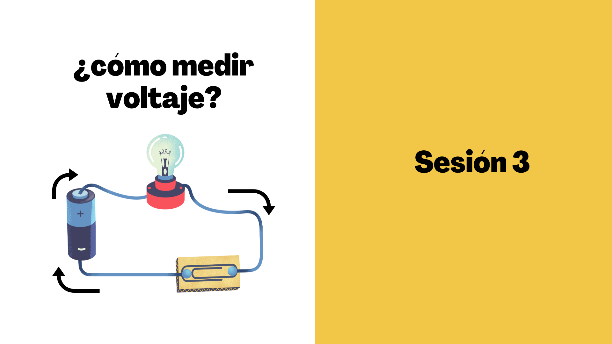

# Cómo Medir la Resistencia Total en Proteus

¡Hola! esta sesion 2 te guía paso a paso para medir la resistencia total (o equivalente) en un circuito usando Proteus Design Suite. Es ideal para estudiantes de primer semestre que están aprendiendo sobre circuitos eléctricos. La resistencia total es la suma de todas las resistencias en serie o el cálculo equivalente en paralelo.

## Requisitos Previos
- Proteus instalado.
- Un proyecto abierto con un circuito simple (por ejemplo, resistencias en serie o paralelo).

## Pasos para Medir la Resistencia Total

### 1. Crea o Abre tu Circuito
- Abre Proteus y carga un proyecto existente o crea uno nuevo.
- Agrega resistencias al diseño (consulta el README de la sesión 1 si necesitas ayuda para agregar elementos).
- Conecta las resistencias: en serie (una tras otra) o en paralelo (conectadas a los mismos puntos).

### 2. Agrega un Multímetro (Voltímetro/Amperímetro)
- En la **Library Browser**, busca "MULTIMETER" o "VOLTMETER".
- Arrástralo al diseño.
- Configúralo como "Ohmmeter" (medidor de resistencia): haz doble clic y selecciona la opción de resistencia (Ω).

### 3. Conecta el Multímetro
- Conecta las puntas del multímetro a los extremos del circuito donde quieres medir la resistencia total.
- Para resistencia total, desconecta cualquier fuente de voltaje (como baterías) para medir solo la resistencia.

### 4. Simula el Circuito
- Haz clic en el botón "Play" (▶️) en la barra de herramientas para iniciar la simulación.
- El multímetro mostrará el valor de la resistencia total en ohmios (Ω).

### 5. Interpreta los Resultados
- Si las resistencias están en serie: R_total = R1 + R2 + ...
- Si están en paralelo: 1/R_total = 1/R1 + 1/R2 + ...
- Compara con tus cálculos manuales para verificar.

### 6. Guarda y Documenta
- Guarda el proyecto.
- Anota los valores en un cuaderno o en el README.

## Consejos para Principiantes
- **Circuito simple primero**: Usa dos resistencias de 1kΩ en serie para practicar.
- **Modo correcto**: Asegúrate de que el multímetro esté en modo resistencia (no voltaje o corriente).
- **Errores comunes**: Si el circuito tiene una fuente de voltaje conectada, el multímetro no medirá correctamente la resistencia.
- **Ayuda integrada**: Usa **Help > Tutorials** en Proteus para más ejemplos.
- Practica con diferentes configuraciones: serie, paralelo y combinadas.

## Ejemplo Rápido
- Agrega dos resistencias de 1kΩ en serie.
- Conecta el multímetro a los extremos.
- Simula: deberías ver 2kΩ en el multímetro.

¡Experimenta y aprende! Si tienes preguntas, revisa los tutoriales o pregunta en clase.

---
